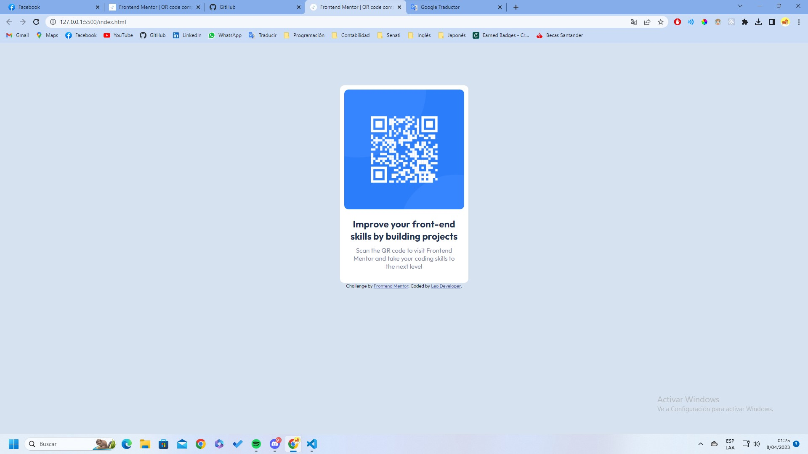

# Frontend Mentor - QR code component solution

This is a solution to the [QR code component challenge on Frontend Mentor](https://www.frontendmentor.io/challenges/qr-code-component-iux_sIO_H). Frontend Mentor challenges help you improve your coding skills by building realistic projects. 

## Table of contents

- [Overview](#overview)
  - [Screenshot](#screenshot)
  - [Links](#links)
- [My process](#my-process)
  - [Built with](#built-with)
  - [What I learned](#what-i-learned)
  - [Continued development](#continued-development)
  - [Useful resources](#useful-resources)
- [Author](#author)
- [Acknowledgments](#acknowledgments)

## Overview

### Screenshot



### Links

- Solution URL: [Add solution URL here](https://github.com/LeoEstaProgramando/QR-code-component/tree/master/01.QR-code-component)
- Live Site URL: [Add live site URL here](https://your-live-site-url.com)

## My process

### Built with

- Semantic HTML5 markup
- CSS custom properties
- Flexbox

### What I learned

In this section I put into practice my basic knowledge of HTML and CSS.


```html
<!DOCTYPE html>
<html lang="en">
<head>
  <meta charset="UTF-8">
  <meta name="viewport" content="width=device-width, initial-scale=1.0">
  <link rel="icon" type="image/png" sizes="32x32" href="./images/favicon-32x32.png">
  <link rel="stylesheet" href="style.css">
  <title>Frontend Mentor | QR code component</title>
</head>
<body>
  <section class="container">
    
    <h2>Improve your front-end skills by building projects</h2>
    <p>Scan the QR code to visit Frontend Mentor and take your coding skills to the next level</p>
  </section>
  <footer>
    <div class="attribution">
      Challenge by <a href="https://github.com/LeoEstaProgramando" target="_blank">Frontend Mentor</a>. 
      Coded by <a href="#">Leo Developer</a>.
    </div>
  </footer> 
</body>
</html>
```
```css
.proud-of-this-css {
  color: papayawhip;
}
```
```js
const proudOfThisFunc = () => {
  console.log('🎉')
}
```

If you want more help with writing markdown, we'd recommend checking out [The Markdown Guide](https://www.markdownguide.org/) to learn more.

**Note: Delete this note and the content within this section and replace with your own learnings.**

### Continued development

Use this section to outline areas that you want to continue focusing on in future projects. These could be concepts you're still not completely comfortable with or techniques you found useful that you want to refine and perfect.

**Note: Delete this note and the content within this section and replace with your own plans for continued development.**

## Author

- Frontend Mentor - [@LeoEstaProgramando](https://www.frontendmentor.io/profile/LeoEstaProgramando)

## Acknowledgments

I thank OpenBootCamp (https://open-bootcamp.com/) for giving me HTML and CSS knowledge through their free courses.