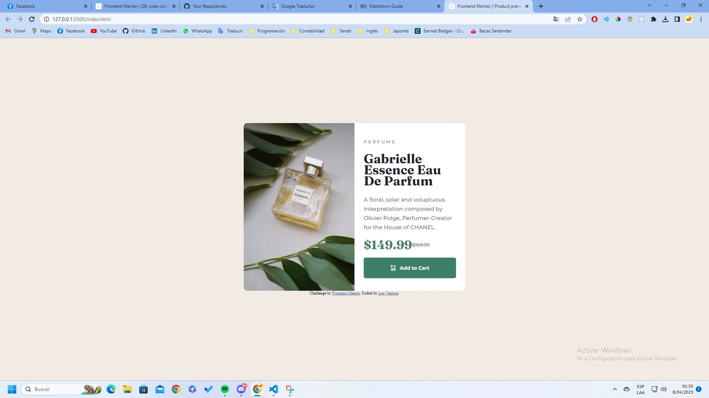

# Frontend Mentor - Product preview card component solution

This is a solution to the [Product preview card component challenge on Frontend Mentor](https://www.frontendmentor.io/challenges/product-preview-card-component-GO7UmttRfa). Frontend Mentor challenges help you improve your coding skills by building realistic projects.

## Table of contents

- [Overview](#overview)
  - [The challenge](#the-challenge)
  - [Screenshot](#screenshot)
  - [Links](#links)
- [My process](#my-process)
  - [Built with](#built-with)
  - [What I learned](#what-i-learned)
  - [Continued development](#continued-development)
- [Author](#author)

## Overview

### The challenge

Users should be able to:

- View the optimal layout depending on their device's screen size
- See hover and focus states for interactive elements

### Screenshot



### Links

- Solution URL: [Product preview card component](https://github.com/LeoEstaProgramando/QR-code-component/tree/master/02.Product-preview-card-component)

## My process

### Built with

- Semantic HTML5 markup
- CSS custom properties
- Flexbox
- CSS Grid
- Mobile-first workflow

### What I learned

In this section I learned the use of 'span' in HTML and the use of the 'display: grid' in CSS.

```html
<div class="precio">
  <span id="precio-actual">$149.99</span>
  <span id="precio-anterior">$169.99</span>
</div>
```

```css
.precio {
  display: grid;
  grid-template-columns: repeat(2, 1fr);
  grid-template-rows: repeat(1, 1fr);
  align-items: center;
}
```

### Continued development

For future projects, I will continue to learn the use of the 'display: grid'.

## Author

- Frontend Mentor - [@LeoEstaProgramando](https://www.frontendmentor.io/profile/LeoEstaProgramando)
