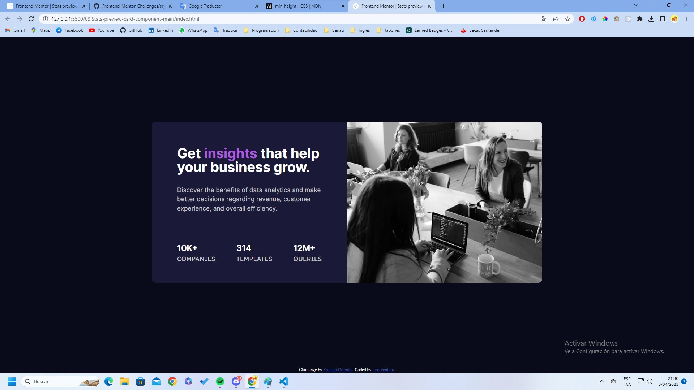

# Frontend Mentor - Stats preview card component solution

This is a solution to the [Stats preview card component challenge on Frontend Mentor](https://www.frontendmentor.io/challenges/stats-preview-card-component-8JqbgoU62). Frontend Mentor challenges help you improve your coding skills by building realistic projects.

## Table of contents

- [Overview](#overview)
  - [The challenge](#the-challenge)
  - [Screenshot](#screenshot)
  - [Links](#links)
- [My process](#my-process)
  - [Built with](#built-with)
  - [What I learned](#what-i-learned)
  - [Continued development](#continued-development)
  - [Useful resources](#useful-resources)
- [Author](#author)
- [Acknowledgments](#acknowledgments)

## Overview

### The challenge

Users should be able to:

- View the optimal layout depending on their device's screen size

### Screenshot



### Links

- Solution URL: [https://github.com/LeoEstaProgramando/Frontend-Mentor-Challenges/tree/master/03.Stats-preview-card-component-main](https://github.com/LeoEstaProgramando/Frontend-Mentor-Challenges/tree/master/03.Stats-preview-card-component-main)
- Live Site URL: [https://leoestaprogramando.github.io/Frontend-Mentor-Challenges/03.Stats-preview-card-component-main](https://leoestaprogramando.github.io/Frontend-Mentor-Challenges/03.Stats-preview-card-component-main)

## My process

### Built with

- Semantic HTML5 markup
- CSS custom properties
- Flexbox
- Mobile-first workflow

### What I learned

In this section, I have learned to use the span in HTML, and to use the text-transform propertie in CSS.

```html
<h1>Get <span>insights</span> that help your business grow.</h1>
<p>
  Discover the benefits of data analytics and make better decisions regarding
  revenue, customer experience, and overall efficiency.
</p>
```

```css
.contenedor ul li {
    list-style: none;
    text-transform: uppercase;
    font-family: 'Lexend Deca', sans-serif;
}
```

### Continued development

In my futures projects, I am going to use more CSS properties.

## Author

- Website - [LeoEstaProgramando](https://leoestaprogramando.github.io)
- Frontend Mentor - [@LeoEstaProgramando](https://www.frontendmentor.io/profile/LeoEstaProgramando)
